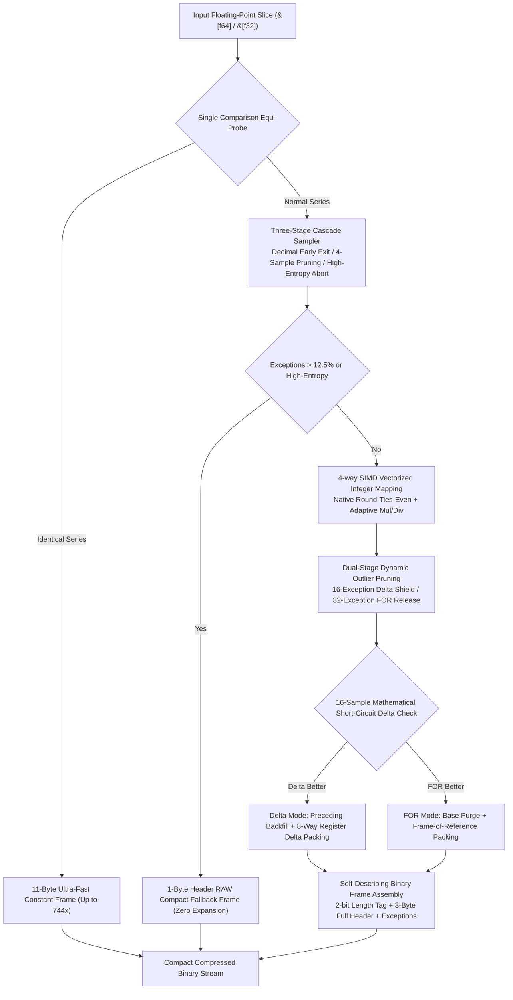

## Architecture & Design

`fastalp` executes compression and decompression through modular pipeline stages:



### Compression Pipeline

- **Equi-value Detection & Fallback (`encoder.rs`)**:<br>
  Single-cycle branchless check (`slice[1] == slice[0]`) to detect constant sequences; emits 1024 uniform elements in 11 bytes (744x ratio). Automatically reverts to 1-byte RAW fallback if data entropy exceeds 12.5% exception ceiling to prevent negative compression.

- **Three-Stage Cascade Parameter Sampling (`sampler.rs`)**:<br>
  Replaces unpruned 190-combination searches: Stage 1 tests pure decimal multiplication on high-frequency exponents with a 6-sample zero-exception fast-return; Stage 2 rapidly weeds out unpromising candidate factors using 4-sample probes; Stage 3 aborts immediately on non-decimal high-entropy data.

- **4-way Unrolled SIMD Mapping & Decimal Division (`kernel.rs`, `float/`)**:<br>
  Utilizes hardware-native round-ties-even instructions (ARM64 `FRINTN` / x86 `ROUNDSD`), eliminating legacy magic-number overflow. Dynamically triggers decimal division (`use_div`) to eliminate 1-ULP multiplication truncation errors. Simultaneously tracks extremum reduction trees and probes for zero block exceptions in a single pass.

- **Dual-Stage Dynamic Outlier Pruning (`outlier.rs`, `engine.rs`)**:<br>
  Constrains exception budget to 16 during pre-pruning to shield Delta candidates, then relaxes exclusively to 32 in FOR mode to crush long-tail spike bit-widths; restores base values prior to FOR pruning to purge Delta backfill artifacts.

- **Adaptive Delta Difference & Short-Circuit Check (`delta/`, `encoder/delta.rs`)**:<br>
  Probes first 16 samples to mathematically prove whether difference bit-width can beat FOR mode, short-circuiting in under 10ns; backfills preceding integers at exception slots; packs differences in 8-way fused register pipelines with zero memory roundtrips.

- **Full-Bitwidth Const Generics Bitpacking (`bitpack/pack.rs`)**:<br>
  Leverages 8-element periodic invariant (8 elements strictly consume $BW$ bytes) through `match_pack_32!` dispatch; special-cases 52-bit double pairs and 56-bit 7-byte direct stores.

### Decompression Pipeline

- **Self-Describing Header Parsing (`header.rs`)**:<br>
  Reads 1-byte descriptor with 2-bit length tag (1024-element full block, u8, u16, u32 length tiers), natively streaming arbitrary array slices; 3-byte header for full blocks, 1-byte header for RAW fallbacks.

- **Fused Single-Pass Consumer & 1-Cycle Recurrence Decoupling (`bitpack/unpack/`)**:<br>
  Eliminates 8KB scratch buffers by decoupling decoding into `AlpConsumer` single-pass pipelines. Bit-unpacking, FOR base addition, or prefix-sum recurrence and float reconstruction happen directly in registers; shrinks cross-iteration loop dependencies to 1 clock cycle for 18 ~ 28 GB/s delta decompression.

- **16-Element Wide Word Loading & L1D Local Tables (`kernel.rs`, `decoder.rs`)**:<br>
  Unpacks 16 elements per 64-bit load on narrow bit-widths (1, 2, 4 bits) using `write_16!`; accelerates decimal division and narrow widths with 256-entry stack-resident L1D lookup tables.

- **Branch-Free Repeat Expansion (`decoder/mod.rs`)**:<br>
  Applies bitwise state transition invariants to eliminate all conditional branches and pipeline stalls during repeat expansion; triggers 64-element native SIMD copies/broadcasts on full-zero/full-one words.

- **Real Doubles (ALP-RD) Direct Streaming Decode (`decoder/standard.rs`, `rd.rs`)**:<br>
  Streams unpacked low-bit mantissas directly to destination pointers, followed by in-place bitwise-OR dictionary merging, boosting decompression throughput to 11.6+ GB/s.

- **In-Place Exception Patching (`decoder/mod.rs`)**:<br>
  Directly restores exact IEEE 754 bit representations at recorded exception indices without buffer reallocation.

---

## Technology Stack

- **Language**: Rust Edition 2024
- **Error Handling**: `thiserror`
- **Testing & Benchmarks**: `anyhow`, `aok`, `fastrand`

---

## Project Architecture

```
fastalp/
├── Cargo.toml          # Crate manifest and dependency configuration
├── README.md           # Generated multilingual documentation
├── README.mdt          # Multilingual documentation template
├── readme/             # Documentation source files
│   ├── en/             # English document modules (intro, usage, architecture, bench, evolution, capi, log)
│   └── zh/             # Chinese document modules (intro, usage, architecture, bench, evolution, capi, log)
├── src/                # Library source code
│   ├── bitpack/        # Modular bit-level packing and unpacking
│   │   ├── mod.rs      # Module facade and re-exports
│   │   ├── pack.rs     # Dense bitpacking with match_pack_32 dispatch
│   │   └── unpack/     # Decoupled bit-unpacking engine
│   │       ├── mod.rs      # Top-level dispatch and safe facades
│   │       ├── consumer.rs # AlpConsumer abstraction (FOR/Delta prefix-sum/raw writes)
│   │       ├── decoder.rs  # AlpDecoder float reconstruction (Mul/Div/RD/Dict)
│   │       └── kernel.rs   # 64-way monomorphized unpacking subkernels
│   ├── capi.rs         # Optional C-compatible FFI bindings and handle management
│   ├── constants.rs    # Precomputed static power tables and format constants
│   ├── decoder/        # Generic decompression pipeline & decimal division reconstruction
│   │   ├── mod.rs      # Decompression facade and mode dispatch
│   │   ├── standard.rs # Standard FOR reconstruction decompression
│   │   └── delta.rs    # Delta first-order difference decoding
│   ├── delta/          # First-order difference cost estimation and prefix sums
│   │   └── mod.rs
│   ├── encoder/        # Generic compression pipeline and state caching
│   │   ├── mod.rs      # Top-level entry points and compression facade
│   │   ├── state.rs    # Stateful Encoder struct and working buffer reuse
│   │   ├── engine.rs   # Core compression engine and 3-stage validation
│   │   ├── kernel.rs   # 4-way unrolled branchless vectorized encoding kernel
│   │   ├── outlier.rs  # FOR-mode outlier pruning algorithm
│   │   ├── exception.rs# Exception layout and compact serialization
│   │   ├── standard.rs # Standard FOR frame assembly
│   │   ├── delta.rs    # Delta difference frame assembly
│   │   ├── dict.rs     # Sparse constant and impulse dictionary encoding
│   │   └── rd.rs       # Real Doubles (ALP-RD) stack hash construction
│   ├── error.rs        # Error definitions and Result type aliases
│   ├── float/          # AlpFloat trait and generic lossless transformations
│   │   ├── mod.rs      # AlpFloat trait and lookup table builders
│   │   ├── f32.rs      # Single-precision f32 multiply/divide implementations
│   │   └── f64.rs      # Double-precision f64 multiply/divide implementations
│   ├── header.rs       # Self-describing header with 2-bit length tags
│   ├── lib.rs          # Crate root and public exports
│   ├── macros.rs       # Global unrolling, array construction, and bit-width dispatch macros
│   ├── params.rs       # Compact bitfield parameters and bit-width calculators
│   └── sampler.rs      # Parameter sampling and validation
├── test.sh             # Test execution script
└── tests/              # Integration and stress testing
    ├── test_alp_dataset.rs # ALP paper 31 real-world datasets roundtrip & ratio tests
    ├── test_delta.rs       # Specialized delta difference tests & edge cases
    └── test_roundtrip.rs   # Comprehensive lossless roundtrip & boundary tests
```
