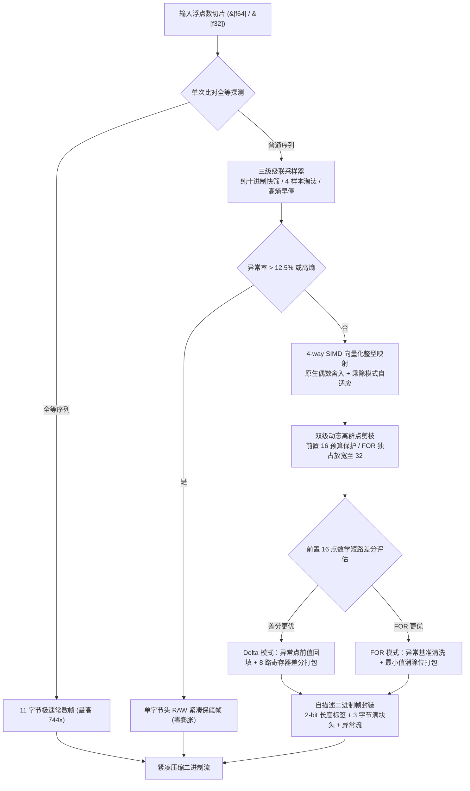

## 架构设计

`fastalp` 编解码流程划分为以下阶段：



### 压缩流程

- **单次比较全等快跳与保底分流 (`encoder.rs`)**：<br>
  在编码入口仅用 1 次 `slice[1] == slice[0]` 快速比对，1 个时钟周期完成非全等流判别；全等序列仅需 11 字节即可压缩 1024 元素（压缩比高达 744x）；<br>
  设定 12.5% 异常上限门限，高熵随机浮点数在探测到负压缩时立即直降单字节头部的 RAW 紧凑保底模式，彻底杜绝数据膨胀。

- **三级级联微架构采样 (`sampler.rs`)**：<br>
  颠覆原版 $190 \times 32$ 次暴力枚举：第 1 级按经验高频分布（2, 1, 3, 0..）优先试探纯十进制乘法，结合 6 样本快筛零异常即刻返回；第 2 级在候选因子评估中以 4 样本快速淘汰高异常项；第 3 级非十进制特征即刻熔断。采样吞吐提升 4.6x 以上。

- **4-way 展开向量化整型映射与十进制除法 (`kernel.rs`, `float/`)**：<br>
  基于 `fearless-simd` 实现目标硬件原生单指令偶数舍入（ARM64 `FRINTN` / x86 `ROUNDSD`），消除 Magic Number 取值范围溢出；<br>
  针对 IEEE 754 乘法截断误差，动态启用十进制精确除法重构（`use_div`），虚假异常直接归零；4-way ILP 展开单趟同步维护极值规约树并探测全块零异常。

- **双级动态离群点剪枝与差分清洗 (`outlier.rs`, `engine.rs`)**：<br>
  前置预剪枝将预算严格控制在 16 个以保护时序差分；在判定进入 FOR 模式后独占放宽至 32 个预算，连续降序探索候选位宽，深层收窄带尖峰长尾数据位宽；在 FOR 剪枝前原子恢复基准值，消除 Delta 回填引入的 `patch_val` 污染。

- **自适应一阶差分与数学短路快筛 (`delta/`, `encoder/delta.rs`)**：<br>
  基于局部子集极值跨度定理，仅取前 16 采样项对比差分与基准位宽，不优即刻短路跳出；差分模式下将异常点用前值回填消除人工阶跃跳变；采用 8 路寄存器级熔合差分位打包，零临时内存回写。

- **全位宽常量单态化打包 (`bitpack/pack.rs`)**：<br>
  基于 8 元周期数学定理（每 8 个元素严格占据 $BW$ 整字节），通过 `match_pack_32!` 将 1 至 32 位宽常量展开；针对 52 位与 56 位专门优化双元素与 7 字节宽字直写，实现最高吞吐位打包。

### 解压流程

- **自描述极简头解析 (`header.rs`)**：<br>
  首字节读取自描述描述符，由 2-bit 长度标签直接解析出元素总数（支持 1024 满块、u8、u16、u32 长度档位），支持无界超大数组原生流式解析；标准 1024 满块头仅占 3 字节，RAW 保底模式仅占 1 字节。

- **单趟解包消费器融合与前缀和依赖解耦 (`bitpack/unpack/`)**：<br>
  淘汰原版解包至 8KB 临时栈缓冲、再双重循环遍历内存的传统做法。抽象 `AlpConsumer` 单态化流水线，在位解包内核循环体内直接原位完成 FOR 消除或差分前缀和累加，并直接转换浮点数写入目标内存，全过程零中间内存分配与重读；<br>
  在差分消费器中将跨 8 元素循环依赖时延压至 1 周期，平滑时序差分解码吞吐达 18 ~ 28 GB/s。

- **低位宽 16 元素宽加载与 L1D 局部查表 (`kernel.rs`, `decoder.rs`)**：<br>
  在 1、2、4 位小位宽解包中全面推行 16 元素展开，单次 64 位宽字读取直解 16 个元素并 `write_16!`；除法与小位宽模式使用栈上 256 项 L1D 局部查找表，纳秒级命中。

- **时序重复游程无分支展开 (`decoder/mod.rs`)**：<br>
  应用位图无分支递推恒等式消除全部条件分支与流水线冲刷；全零与全壹字触发 64 元素原生 SIMD 拷贝与广播写，密集重复数据解压吞吐跃升 50% ~ 70%。

- **真实双精度高低位解耦直通解码 (`decoder/standard.rs`, `rd.rs`)**：<br>
  淘汰旧版微切片与双重缓冲，高位宽尾数直接解包写入目标裸指针内存，高位字典原地原位位或合并，真实双精度解码吞吐突破 11.6+ GB/s。

- **异常值原位精准覆盖 (`decoder/mod.rs`)**：<br>
  若存在尾部异常流，按记录的原始索引与原始 IEEE 754 位原位精准覆盖，确保数值还原位级无损。

---

## 技术栈

- **开发语言**：Rust Edition 2024
- **错误处理**：`thiserror`
- **测试与基准**：`anyhow`, `aok`, `fastrand`

---

## 目录结构

```
fastalp/
├── Cargo.toml          # 项目配置与依赖声明
├── README.md           # 生成的多语言文档
├── README.mdt          # 多语言文档模板
├── readme/             # 文档源码目录
│   ├── en/             # 英文文档模块 (intro, usage, architecture, bench, evolution, capi, log)
│   └── zh/             # 中文文档模块 (intro, usage, architecture, bench, evolution, capi, log)
├── src/                # 核心源代码
│   ├── bitpack/        # 模块化位打包与位解包
│   │   ├── mod.rs      # 门面导出
│   │   ├── pack.rs     # 128 位累加器位打包算子与 match_pack_32 派发
│   │   └── unpack/     # 模块化分层位解包算子体系
│   │       ├── mod.rs      # 解包顶层调度与安全门面
│   │       ├── consumer.rs # AlpConsumer 消费器抽象（FOR/Delta前缀和/原始写入）
│   │       ├── decoder.rs  # AlpDecoder 浮点重构器（乘法/除法/RD/字典）
│   │       └── kernel.rs   # 64 路定宽解包与展开内联内核
│   ├── capi.rs         # C 兼容 FFI 接口与独立编码器句柄
│   ├── constants.rs    # 静态幂次表与格式常量
│   ├── decoder/        # 泛型流式解压与除法重构
│   │   ├── mod.rs      # 解压门面与模式派发
│   │   ├── standard.rs # 标准 FOR 还原解压
│   │   └── delta.rs    # Delta 一阶差分解码
│   ├── delta/          # 一阶差分自适应收益评估与前缀和
│   │   └── mod.rs
│   ├── encoder/        # 泛型压缩流水线与参数缓存
│   │   ├── mod.rs      # 编码门面与顶层便捷函数
│   │   ├── state.rs    # 状态化 Encoder 结构体与工作缓冲区复用
│   │   ├── engine.rs   # 压缩编排引擎与参数三级校验
│   │   ├── kernel.rs   # 4-way 展开无分支向量化编码内核
│   │   ├── outlier.rs  # FOR 模式离群值剪枝算法
│   │   ├── exception.rs# 异常值结构与紧凑序列化
│   │   ├── standard.rs # 标准 FOR 编码组装
│   │   ├── delta.rs    # Delta 一阶差分编码组装
│   │   ├── dict.rs     # 稀疏常数与脉冲离群值字典编码
│   │   └── rd.rs       # 真实双精度（RD）高低位解耦与全栈哈希构建
│   ├── error.rs        # 错误枚举定义与 Result 类型别名
│   ├── float/          # AlpFloat 浮点抽象特征与泛型无损转换
│   │   ├── mod.rs      # AlpFloat trait 定义与查表构建
│   │   ├── f32.rs      # 单精度 f32 乘法/除法编解码实现
│   │   └── f64.rs      # 双精度 f64 乘法/除法编解码实现
│   ├── header.rs       # 紧凑自描述头部编解码与 2-bit 长度标签档位管理
│   ├── lib.rs          # 导出接口与高层封装
│   ├── macros.rs       # 全局循环展开、数组构造与位宽派发宏体系
│   ├── params.rs       # 紧凑位域参数打包与位宽计算
│   └── sampler.rs      # 参数采样与无损重构验证
├── test.sh             # 测试运行脚本
└── tests/              # 集成与压力测试
    ├── test_alp_dataset.rs # ALP 论文 31 真实数据集往返与压缩比评测
    ├── test_delta.rs       # Delta 差分时序专项与异常测试
    └── test_roundtrip.rs   # 往返无损与边界测试
```
